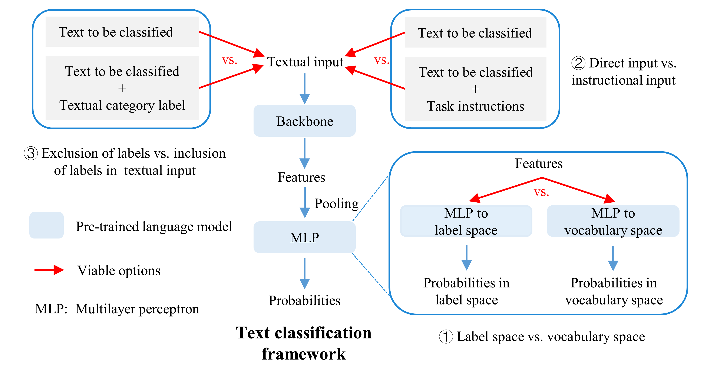
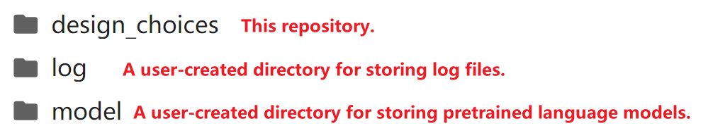

# Three key design choices within fine-tuning frameworks for text classification


This repository contains code for systematically investigating three key design choices in text classification frameworks.

# Requirements

Python 3.10.8 == 3.10.8

accelerate == 1.1.0

peft == 0.13.2

transformers == 4.46.2

torch  ==  2.1.2+cu118

# Directory structure



# Pretrained language models

| Model                                 | Hugging Face model page                                  |
| ------------------------------------- | -------------------------------------------------------- |
| google-bert/bert-base-uncased         | <https://huggingface.co/google-bert/bert-base-uncased>   |
| google-bert/bert-base-chinese         | https://huggingface.co/google-bert/bert-base-chinese     |
| Qwen/Qwen2.5-0.5B                     | <https://huggingface.co/Qwen/Qwen2.5-0.5B>               |
| Alibaba-NLP/gte-multilingual-mlm-base | https://huggingface.co/Alibaba-NLP/gte-multilingual-base |
| openbmb/MiniCPM-1B-sft-bf16           | https://huggingface.co/openbmb/MiniCPM-1B-sft-bf16       |

# Datasets

The dataset names and download addresses are listed in the table below. The datasets converted to Hugging Face's DatasetDict format can be found in the `design_choices/data` folder. Only format conversion has been performed, with no substantive modifications made to the original data.

| Dataset   | URL                                                          |
| --------- | ------------------------------------------------------------ |
| AG's News | https://huggingface.co/datasets/SetFit/ag_news               |
| SST-5     | https://huggingface.co/datasets/SetFit/sst5                  |
| TNEWS     | <https://github.com/CLUEbenchmark/CLUE?tab=readme-ov-file>   |
| AEC_TC    | <https://github.com/SkydustZ/Text-Classification-Based-Approach-for-Evaluating-and-Enhancing-Machine-Interpretability-of-Building> |

# How to use?

1.Download models and place them into the model folder.

2.Modify the training_config.json file in the design_choices/configs folder to specify the model and dataset to be used and other hyperparameters. The parameter index mapping for "data_format" is as follows:

| data_format | ProjSp | InParad | LblCtx |
| :---: | :---: | :---: | :---: |
|      1      |  Lab   |   Dir   |  Excl  |
|      2      |  Lab   |   Dir   |  Incl  |
|      3      |  Lab   |  Inst   |  Excl  |
|      4      |  Lab   |  Inst   |  Incl  |
|      5      |  Voc   |   Dir   |  Excl  |
|      6      |  Voc   |   Dir   |  Incl  |
|      7      |  Voc   |  Inst   |  Excl  |
|      8      |  Voc   |  Inst   |  Incl  |

3.Run the main.py file in the design_choices folder.

```
python main.py
```

4.Result files can be found in the log folder. 